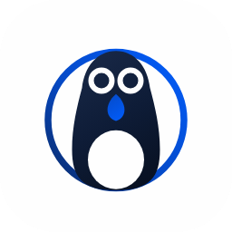

# Adelie

一个能自己动手干活的智能体：**同一个引擎，四种形态** —— 命令行、Windows 桌面、网页、手机 PWA。

```
adelie "把 README 里的错别字改掉"        # CLI：交互式会话，或 --task 一次跑完
adelie serve --host 0.0.0.0              # Web / PWA：局域网里手机也能连
pnpm desktop                             # 桌面壳：Electron 起内置服务端，窗口指向它
```

它会在你的工作区里读文件、改代码、跑命令、连 MCP 服务，每一步都留下可回放的记录，
需要动手的动作（改文件、跑命令、网络请求）默认**要你点头**。

<p align="center"></p>

## 四种形态，一套引擎

| 形态 | 跑在哪 | 怎么起 |
| --- | --- | --- |
| **CLI** | 任何有 Node ≥24 的地方 | `npm i -g @lmliheng/adelie` 然后 `adelie` |
| **Windows 桌面** | 自己的进程 + 内置服务端 | 安装 `Adelie-Setup-<version>-x64.exe` |
| **Web** | 本机服务端托管的页面 | `adelie serve` 然后打开 `http://127.0.0.1:7370` |
| **手机 PWA** | 手机上安装的网页 | `adelie serve --host 0.0.0.0`，手机打开带 token 的地址 → 添加到主屏幕 |

四种形态说的是同一套接口（见 [docs/api.md](docs/api.md)），所以新功能一次实现四处都有。

## 结构

```
packages/
  core/         adelie-core        类型、预算、会话持久化、上下文折叠（零依赖）
  providers/    adelie-providers   模型适配层：目录驱动的四家（DeepSeek / OpenAI / Kimi / 通义）
  tools/        adelie-tools       文件 / Git / 命令 / 搜索 / MCP 工具与注册表
  runtime/      adelie-runtime     ReAct 循环、审批、计划、验收、成本闸门
  server/       adelie-server      HTTP + SSE：会话、对话流、审批、Web 托管
  web/          adelie-web         React + Vite + PWA，移动优先
  desktop/      adelie-desktop     Electron 壳（Windows）
  cli/          adelie             CLI：交互会话与 headless 模式
brand/                            名字与图标（见 brand/BRAND.md）
docs/                             接口契约、架构与发布说明
```

依赖是单向的：`core ← providers / tools ← runtime ← {cli, server} ← desktop`。

## 快速开始（源码）

```bash
pnpm install
pnpm typecheck && pnpm test && pnpm build

node packages/cli/dist/cli.js --help      # CLI
node packages/server/dist/main.js         # Web（另开一个终端：pnpm --filter adelie-web dev）
pnpm desktop                              # 桌面
```

模型密钥：`/auth` 写进 `~/.adelie/.env`，或直接用环境变量 `DEEPSEEK_API_KEY`。

## 发布

每次发布产出四件东西：npm 上的 `adelie`（CLI 与库）、Windows 安装包、Web 静态产物、
可直接安装的 PWA 清单。流程见 [docs/release.md](docs/release.md)。

## 来历

- 引擎来自 [lmliheng/AgentCode](https://github.com/lmliheng/AgentCode)（那是一个学习与实战仓库，
  产品代码迁到这里之后仍保留 RAG / MCP / 记忆等示例）。
- 产品形态与视觉语言取自 PenguinHarness：发丝边框、单一蓝色强调、深色模式纯黑，
  以及「桌面壳只做壳、页面里跑全部业务」的分工。
