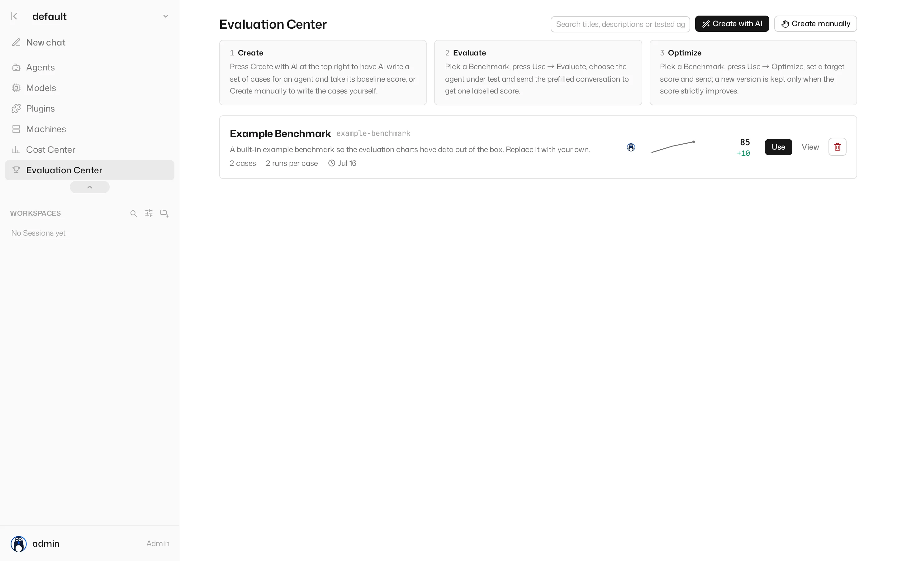
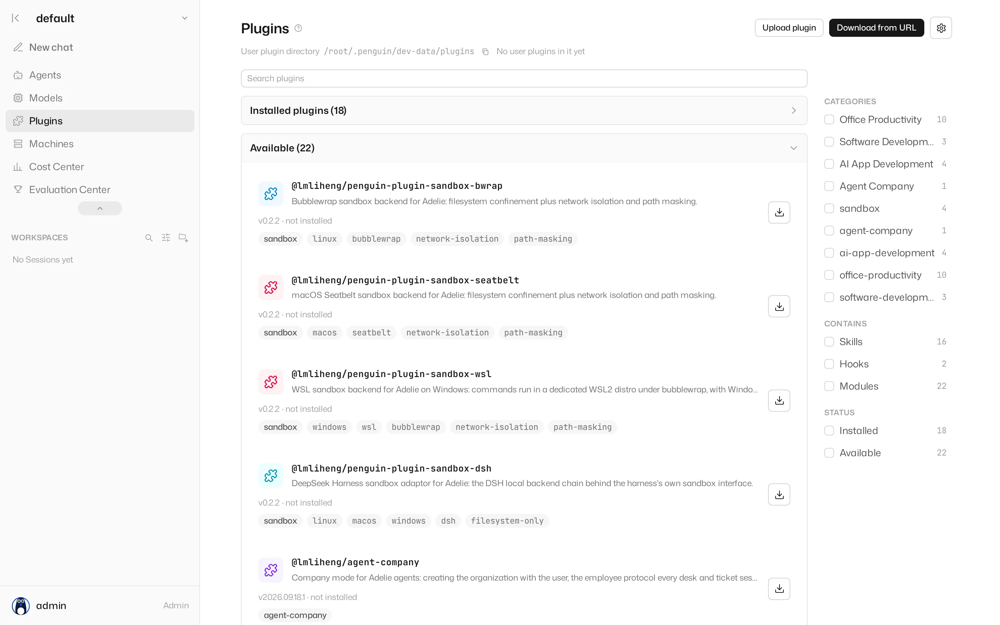

<p align="center">
  
</p>

<h1 align="center">Adelie</h1>

<p align="center"><strong>A local-first multi-agent app development platform, built on PenguinHarness</strong></p>

<p align="center">
  <a href="LICENSE"></a>
  = 24" />
  <a href="https://github.com/Prism-Shadow/penguin-harness"></a>
</p>

> [!IMPORTANT]
> **Adelie is a fork of [PenguinHarness](https://github.com/Prism-Shadow/penguin-harness).** The code
> tree, the engine, the Web frontend and the protocol all come from PenguinHarness (Apache-2.0);
> Adelie is the productised line built on top of it — its own brand and interface, its own data root
> and ports, its own release pipeline.
>
> - Where it came from, what the licence requires, what we changed: [`FORK.md`](docs/FORK.md)
> - How far the work has got: [`FORK-PROGRESS.md`](docs/FORK-PROGRESS.md)
> - The upstream project's own channels — repository, website, docs, blog, community, Discord, X,
>   WeChat, Product Hunt — are **theirs**, not Adelie's: <https://github.com/Prism-Shadow/penguin-harness> ·
>   <https://penguin.ooo/>
> - The PenguinHarness and PrismShadow names and marks belong to upstream. Adelie does not use them
>   as its own name, icon or domain.

<p align="center"><a href="README.zh.md">简体中文</a> | English</p>

## Why Adelie

> Build agents by hand with LangChain at 1× speed; build agents with Adelie at 100× speed.

Adelie runs on your own computer or server and strings together the creation, evaluation, optimisation
and deployment of agent applications. Three reasons, in ascending order:

### 1. 🏆 Excellent results at a fraction of the cost

A deliberately small tool set over a clean interface: fewer tool calls, fewer tokens, and deep
adaptation to open models such as DeepSeek. Same tasks, each on its usual model, head to head:

<p align="center">
  <picture>
    <source media="(prefers-color-scheme: dark)" srcset="assets/readme/benchmark-dark.svg" />
    
  </picture>
</p>

**The most accurate on the data-analysis set — at 1/70th of Claude Code's cost.**

### 2. ⚡ One sentence in, a runnable agent app out

Describe what you want in one sentence and Adelie builds the whole agent application — scaffold,
code, run instructions, in one go:

```text
Collect the docs at https://github.com/ericbuess/claude-code-docs and build a RAG Q&A app that answers as a Claude Code configuration expert, with cited sources.
```

This is what came out — a docs expert: retrieval-augmented, citations that open the original file,
sample questions built in:

<p align="center">
  <picture>
    <source media="(prefers-color-scheme: dark)" srcset="assets/readme/rag-app-en-dark.webp" />
    
  </picture>
</p>

**And generating the whole RAG app cost ¥0.2 ($0.02) in tokens — on the DeepSeek V4 Pro model.**

### 3. 🧬 A native agent self-evolution engine

With Adelie's skill library an agent evaluates and optimises itself: run a Benchmark, find where the
score went, ship version N+1 — with a snapshot before every round and every request replayable in the
trace viewer.

<p align="center">
  <picture>
    <source media="(prefers-color-scheme: dark)" srcset="assets/readme/evaluation-center-en-dark.webp" />
    
  </picture>
</p>

*About the images in this README: the benchmark chart comes from the PenguinHarness authors'
measurement of the very codebase this fork is built on — Adelie runs the same engine and interface, so
what it shows is this fork's capability too. Every screenshot is Adelie's own interface, captured from
a local instance.*

## Built-in plugin library

Four kinds of plugin ship in the box (documented under [`packages/docs`](packages/docs)) — Skills,
plus the session hooks that drive goal mode and continual learning; an agent can also write and
optimise its own Skills:

| Category | Plugins |
| --- | --- |
| Office Productivity | `data-analysis`, `use-firecrawl`, `browser-automation`, `use-bento-slides`, `humanizer`, `goal`, `continual-learning`, `csu-mail`, `lesson-video`, `requirements-box` |
| Software Development | `software-development`, `use-claude-code`, `wechat-miniprogram` |
| AI App Development | `agent-development`, `model-development`, `skill-porting`, `agent-tuning` |
| Agent Company | `agent-company` |

The **plugin market** page lists every plugin that ships with the build, each with its own README,
version, licence and keywords, and installs one in a click:

<p align="center">
  <picture>
    <source media="(prefers-color-scheme: dark)" srcset="assets/readme/plugin-market-en-dark.webp" />
    
  </picture>
</p>

The desktop app also carries a built-in browser in its side dock. An agent drives it through
`penguin browser` and the `browser-automation` plugin: reading pages, clicking and typing, and
extracting data such as Amazon orders — signed in with credentials imported from your own browser.

## Supported models

| Model | Providers |
| --- | --- |
| DeepSeek V4 | DeepSeek, OpenRouter, Fireworks AI, SiliconFlow, TokenDance, Qwen Token Plan, Qwen Pay-As-You-Go |
| Kimi K3 | Moonshot AI, OpenRouter, Fireworks AI, TokenDance, Qwen Pay-As-You-Go |
| GLM 5.3 | Z.AI, OpenRouter, TokenDance |
| Hunyuan 3 | OpenRouter |
| Qwen 3.8 Max | Qwen Token Plan, Qwen Pay-As-You-Go, OpenRouter, TokenDance |
| GPT 5.6 | OpenAI, OpenRouter |
| Gemini 3.7 Flash | Google Gemini, OpenRouter |
| Claude 5 | Anthropic, OpenRouter |
| Inkling | OpenRouter, Fireworks AI |

The table lists only the newest generation of each family; the **Models** page carries the full
built-in catalog. Anything speaking the OpenAI protocol works: pick a preset, or connect 1000+ hosted
and local models with a custom endpoint.

## System requirements

| Requirement | Support |
| --- | --- |
| Operating system | Windows 10+ (x64), Linux (x64), macOS (arm64 / x64) |
| Runtime | The installers bundle Node; npm and from-source installs need Node >= 24 |
| Model | an API key for at least one model provider |

## Install

Adelie ships its own artifacts — desktop installers, CLI bundles and npm packages, every release on
[GitHub Releases](https://github.com/lmliheng/Adelie/releases) with the same assets mirrored to an
Alibaba Cloud OSS bucket (`https://adelie-releases.oss-cn-hangzhou.aliyuncs.com`) for readers in
China. A release is always a whole version: the desktop app, the CLI, the server and the Web frontend
are the same number.

### Desktop app

| Platform | Artifact |
| --- | --- |
| Windows 10+ (x64) | `adelie-desktop-win32-x64.exe` — NSIS installer, per-user, installs under `%LOCALAPPDATA%` |
| Linux (x64) | `adelie-desktop-linux-x86_64.AppImage` or `adelie-desktop-linux-amd64.deb` |
| macOS | not built yet — the dmg/zip targets wait for an Apple Developer ID |

The Windows installer is **not code-signed yet**, so SmartScreen shows its warning once
("More info → Run anyway"). The app checks for updates itself: it reads the OSS mirror's
`latest.yml` first and falls back to GitHub Releases when the mirror is unreachable, so
"Check for updates" inside the app is the normal way to upgrade.

### Command line and Web App

```bash
# Linux / macOS, one line: installs penguin under ~/.adelie, with its own Node runtime
curl -fsSL https://github.com/lmliheng/Adelie/releases/latest/download/install.sh | sh

# or via npm (any platform, needs Node >= 24 on the machine)
npm install -g @lmliheng/penguin-cli
```

Then:

```bash
penguin web      # opens the same interface as the desktop app, in your browser
penguin chat     # or talk to an agent in the terminal
```

The data root is `~/.adelie/data` (`ADELIE_HOME` overrides it; the older `PENGUIN_HOME` is still
honoured, so an install that predates the rename keeps reading its own data). Upgrading replaces
`bin/`, `lib/`, `web/` and `node/` and never touches the data root:

```bash
penguin update --check
penguin update --yes
```

On first start the server prints a first-login link; open it to claim the built-in `admin` account and
set its password (there is no initial password to type). Configure a model on the **Models** page —
a new instance needs one API key before it can run a Task.

> [!WARNING]
> The upstream project's own ways in — `curl https://penguin.ooo/install.sh | sh`,
> `npm install -g @prismshadow/penguin-cli`, `docker run hiyouga/penguinharness`, and the desktop
> downloads on <https://penguin.ooo/download> — install **PenguinHarness**, not Adelie. Adelie has
> its own installers, its own npm scope and its own update feed; use the ones above.

The command name is still `penguin` and the packages still carry the `penguin-` stem (Adelie's own
scope, `@lmliheng/*`); the rename is being done in stages and what is left of it is tracked in
[`FORK-PROGRESS.md`](docs/FORK-PROGRESS.md).

## Contributing

```bash
pnpm install && pnpm build   # build first: core's exports point at dist/
pnpm dev                     # server + Web frontend together (prefixed logs, dependencies built once)
```

The full workspace guide is [CONTRIBUTING.zh.md](.github/CONTRIBUTING.zh.md) (that file is upstream's
and remains broadly accurate): development commands, quality gates, repository layout, changelog
rules. The upstream marketing site, `packages/landing`, has been deleted from this fork.

This fork's own docs are collected in [`docs/`](docs/README.md) — the fork story, the progress log and
every release note — so the repository root stays down to the conventional files.

## Upstream roadmap

This is the upstream project's roadmap, kept here to show where the base is heading. Adelie's own
plans live in [`FORK-PROGRESS.md`](docs/FORK-PROGRESS.md).

- [ ] Benchmark suite released
- [x] Desktop app
- [x] Windows support
- [ ] Agent company and templates
- [ ] Company-level self-evolution
- [ ] OpenShell integration (a shell with permission control)
- More to come…

## Upstream contributors

Thanks to everyone who has contributed to PenguinHarness — this fork stands on their code.

<p align="center">
  <a href="https://github.com/Prism-Shadow/penguin-harness/graphs/contributors"></a>
</p>

## Citation

If you use this code, please cite the upstream project (Adelie is its fork):

```bibtex
@software{penguinharness2026,
  author  = {{PrismShadow Team}},
  title   = {PenguinHarness: Efficient Self-Improving Harness for Everyone},
  year    = {2026},
  url     = {https://github.com/Prism-Shadow/penguin-harness},
  license = {Apache-2.0}
}
```

## Acknowledgements

This project benefits from:

- [MinGit](https://github.com/git-for-windows/git): the bundled POSIX shell and Git on Windows
- [GenericAgent](https://github.com/lsdefine/genericagent): built-in browser automation

See [THIRD-PARTY-NOTICES.md](THIRD-PARTY-NOTICES.md) for the full list.

## License

[Apache-2.0](LICENSE) © 2026 Prism Shadow — that is upstream's copyright. Adelie is its fork and is
released under the same licence; see [`FORK.md`](docs/FORK.md).

Upstream PenguinHarness is built with ❤️ by [Yaowei Zheng](https://github.com/hiyouga), the author of
[LlamaFactory](https://github.com/hiyouga/LlamaFactory), [PrismShadow AI Team](https://github.com/Prism-Shadow)
and [Fable 5](https://www.anthropic.com/news/claude-fable-5-mythos-5). Adelie is a fork of that work.
