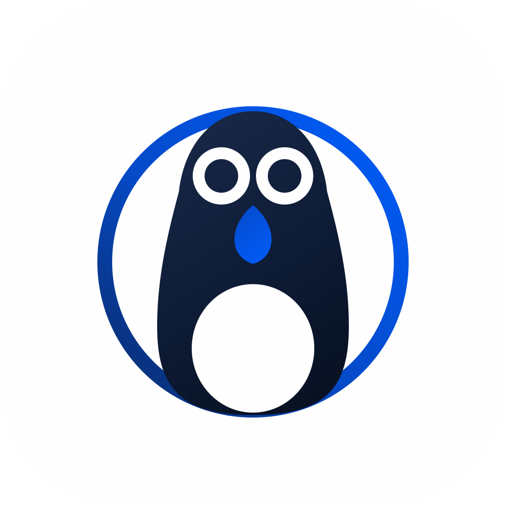
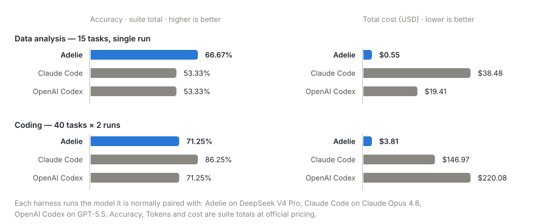

<p align="center">
  
</p>

<h1 align="center">Adelie</h1>

<p align="center"><strong>本地优先的多智能体应用开发平台，构建在 PenguinHarness 之上</strong></p>

<p align="center">
  <a href="LICENSE"></a>
  = 24" />
  <a href="https://github.com/Prism-Shadow/penguin-harness"></a>
</p>

> [!IMPORTANT]
> **Adelie 是 [PenguinHarness](https://github.com/Prism-Shadow/penguin-harness) 的 fork。**
> 这棵代码树、引擎、Web 前端与协议都来自 PenguinHarness（Apache-2.0）；Adelie 是长在它上面的
> 产品线 —— 自己的品牌与界面、自己的数据根与端口、自己的发布链路。
>
> - 来源、许可证义务、我们改了什么：[`FORK.md`](FORK.md)
> - 改到哪一步了：[`FORK-PROGRESS.md`](FORK-PROGRESS.md)
> - 上游自己的渠道（仓库、官网、文档、博客、社区、Discord、X、微信、Product Hunt）是**上游的**，
>   不是 Adelie 的：<https://github.com/Prism-Shadow/penguin-harness> · <https://penguin.ooo/>
> - PenguinHarness / PrismShadow 的名字与商标属于上游。Adelie 不拿它们当自己的名号、图标或域名。

<p align="center"><a href="README.md">English</a> | 简体中文</p>

## 为什么选择 Adelie

> 使用 LangChain，以 1 倍速度人工构建 Agent；<br />使用 Adelie，以 100 倍速度用 Agent 构建 Agent。

Adelie 运行在你的电脑或服务器上，自动串联 Agent 应用的创建、评测、优化与部署。三个递进的理由定义了这个平台：

### 1. 🏆 以几十分之一的成本，跑出优异的效果

刻意精简的工具集配合干净的底层接口：更少的工具调用、更少的 Token，对 DeepSeek 等开放模型深度适配。各自搭配常用模型、同一批任务，正面对比：

<p align="center">
  <picture>
    <source media="(prefers-color-scheme: dark)" srcset="assets/readme/benchmark-dark.svg" />
    
  </picture>
</p>

**数据分析准确率最高——成本只有 Claude Code 的 1/70。**

### 2. ⚡ 一句话生成可运行的 Agent 应用

用一句话描述需求，Adelie 自动构建完整的 Agent 应用——脚手架、代码、运行说明，一步到位：

```text
收集 https://github.com/ericbuess/claude-code-docs 的文档，做一个化身 Claude Code 配置专家、回答带来源引用的 RAG 问答应用。
```

这是做出来的成品——一个文档专家：检索增强、引用可点击直达原文、内置示例问题：

https://github.com/user-attachments/assets/604eb626-0a5d-4a62-87e3-14ebade1cd5f

**而生成整个 RAG 应用，仅消耗了 0.2 元（$0.02）的 token——使用 DeepSeek V4 Pro 模型。**

### 3. 🧬 原生 Agent 自进化引擎

借助 Adelie 技能库，Agent 自己评估、自己优化：跑 Benchmark、找失分点、发布 N+1 版——每轮之前自动快照，每个请求都可在轨迹观测中回放。

https://github.com/user-attachments/assets/aec49ae9-b743-467b-b247-37bedfeaa36e

## 内置插件库

开箱内置四类插件（文档在这个仓库的 [`packages/docs`](packages/docs) 里）——Skill，以及驱动目标模式与持续学习的会话钩子；Agent 也能编写并优化自己的 Skill：

| 分类        | 插件                                                                            |
| ----------- | ------------------------------------------------------------------------------- |
| 办公效率    | `data-analysis`、`use-firecrawl`、`browser-automation`、`use-bento-slides`、`humanizer`、`goal`、`continual-learning` |
| 软件开发    | `software-development`、`use-claude-code`                                |
| AI 应用开发 | `agent-development`、`model-development`、`skill-porting`、`agent-tuning`       |
| Agent 公司  | `agent-company`                                                                 |

桌面应用的侧边停靠栏里还内置了一个浏览器。Agent 通过 `penguin browser` 和 `browser-automation` 插件驱动它：读取页面、点击和输入，并提取亚马逊订单这样的数据，登录用的是从你自己的浏览器导入的账号。

## 支持的模型

| 模型             | 可用供应商                                                                                       |
| ---------------- | ------------------------------------------------------------------------------------------------ |
| DeepSeek V4      | DeepSeek, OpenRouter, Fireworks AI, SiliconFlow, TokenDance, Qwen Token Plan, Qwen Pay-As-You-Go |
| Kimi K3          | Moonshot AI, OpenRouter, Fireworks AI, TokenDance, Qwen Pay-As-You-Go                            |
| GLM 5.3          | Z.AI, OpenRouter, TokenDance                                                                     |
| Hunyuan 3        | OpenRouter                                                                                       |
| Qwen 3.8 Max     | Qwen Token Plan, Qwen Pay-As-You-Go, OpenRouter, TokenDance                                      |
| GPT 5.6          | OpenAI, OpenRouter                                                                               |
| Gemini 3.7 Flash | Google Gemini, OpenRouter                                                                        |
| Claude 5         | Anthropic, OpenRouter                                                                            |
| Inkling          | OpenRouter, Fireworks AI                                                                         |

上表每个系列只列最新一代，完整预置清单请在应用的**模型**页查看；只要是 OpenAI 协议的端点都可以接入：选择预置，或用自定义端点连接 1000+ 在线与本地模型。

## 系统需求

| 需求项   | 支持情况                                            |
| -------- | --------------------------------------------------- |
| 操作系统 | Linux、macOS、Windows 10+                           |
| 架构     | x64、arm64                                          |
| 运行时   | Node >= 24（Adelie 还没有安装包 —— 见「安装」一节） |
| 模型     | 至少一个模型的 API key                              |

## 安装 —— 先读这一节

**Adelie 还没有发布自己的产物。** 没有 Adelie 的 npm 包、安装包、Docker 镜像或下载页 —— 那是计划的
最后一步（[`FORK-PROGRESS.md`](FORK-PROGRESS.md) §4）。现在要跑 Adelie，只有从这棵源码树开始：

```bash
# 装依赖（跳过 desktop / electron：它要下一个运行时，跑 Web 用不到）
pnpm install --frozen-lockfile \
  --filter @prismshadow/penguin-core --filter @prismshadow/penguin-ui \
  --filter @prismshadow/penguin-server --filter @prismshadow/penguin-web \
  --filter @prismshadow/penguin-cli --filter @prismshadow/penguin-hmr

# 构建（core 的导出指向 dist/，不先构建就跑不起来）
pnpm -r --filter @prismshadow/penguin-core --filter @prismshadow/penguin-server \
        --filter @prismshadow/penguin-web run build

# 起服务端 + 已构建的 Web 前端
cd packages/server
PENGUIN_HOME=<数据根> HOST=0.0.0.0 PORT=<端口> node dist/index.js
```

首次启动会在输出里打印一条「首次登录链接」，在设密码之前每次启动都会打印：打开它认领内置的
`admin` 账号并设置密码（没有可输入的初始密码）。模型在应用内的**模型库**页配置 —— 新实例要先配一个
API key 才能跑任务。

> [!WARNING]
> 上游 README 里的那些方式 —— `curl https://penguin.ooo/install.sh | sh`、
> `npm install -g @prismshadow/penguin-cli`、`docker run hiyouga/penguinharness`、
> <https://penguin.ooo/download> 上的桌面安装包 —— 装出来的是 **PenguinHarness**，不是 Adelie。
> 那些渠道在 Adelie 发布自己的产物之前，仍然属于上游。

包名、数据根与命令名还留着上游的拼写（`@prismshadow/*`、`~/.penguin/data`、`penguin`）—— 改名是
分期做的，还没做完的部分记在 [`FORK-PROGRESS.md`](FORK-PROGRESS.md)。

## 参与开发

```bash
pnpm install && pnpm build   # 先构建：core 的导出指向 dist/
pnpm dev                     # 后端 + Web 前端一起起（日志带前缀，依赖只构建一次）
```

完整的工作区指南见 [CONTRIBUTING.zh.md](.github/CONTRIBUTING.zh.md)（那份文件是上游的，大体仍准确）：
开发命令、质量门禁、仓库结构、变更日志规则。上游的官网站点 `packages/landing` 已在本 fork 中删除。

## 上游路线图

这里是上游项目的路线图，留作了解这个基座往哪走。Adelie 自己的计划在
[`FORK-PROGRESS.md`](FORK-PROGRESS.md)。

- [ ] Benchmark 套件正式发布
- [x] 桌面端应用
- [x] Windows 系统支持
- [ ] Agent 公司与模板
- [ ] 公司级自进化能力
- [ ] 集成 OpenShell（带权限管控的 shell）
- 更多规划，敬请期待……

## 上游贡献者

感谢每一位为 PenguinHarness 作出贡献的开发者 —— 这个 fork 建在它的代码之上。

<p align="center">
  <a href="https://github.com/Prism-Shadow/penguin-harness/graphs/contributors"></a>
</p>

## 引用

如果你用到了这套代码，请引用它的上游项目（Adelie 是它的 fork）：

```bibtex
@software{penguinharness2026,
  author  = {{PrismShadow Team}},
  title   = {PenguinHarness: Efficient Self-Improving Harness for Everyone},
  year    = {2026},
  url     = {https://github.com/Prism-Shadow/penguin-harness},
  license = {Apache-2.0}
}
```

## 致谢

本项目受益于：

- [MinGit](https://github.com/git-for-windows/git)：Windows 版内置的 POSIX shell 与 Git
- [GenericAgent](https://github.com/lsdefine/genericagent)：内置浏览器自动化

许可证详见 [THIRD-PARTY-NOTICES.md](THIRD-PARTY-NOTICES.md)。

## 协议

[Apache-2.0](LICENSE) © 2026 Prism Shadow —— 这是上游的版权。Adelie 是它的 fork，
以同一协议发布；见 [`FORK.md`](FORK.md)。

上游 PenguinHarness 由 [LlamaFactory](https://github.com/hiyouga/LlamaFactory) 作者 [Yaowei Zheng](https://github.com/hiyouga)、[PrismShadow AI Team](https://github.com/Prism-Shadow) 与 [Fable 5](https://www.anthropic.com/news/claude-fable-5-mythos-5) 共同用 ❤️ 构建。Adelie 是这份工作的 fork。
